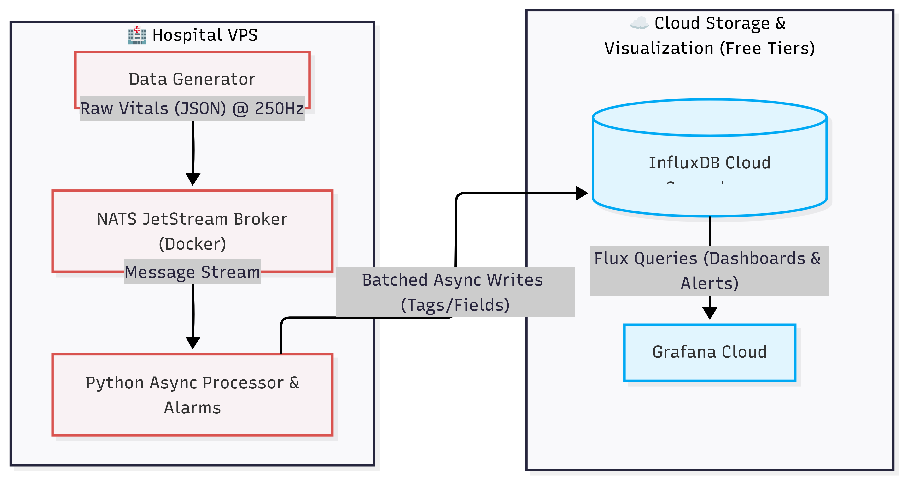

# Medical Data Streaming Pipeline 🩺
### (Python, Kafka, Spark Structured Streaming, InfluxDB, Grafana)

## Contents

- [Introduction](#introduction)
- [How to Run](#how-to-run)
- [Architecture](#architecture)
- [Improvements](#improvements)
- [Conclusion](#conclusion)

## Introduction

The Medical Data Streaming Pipeline is a Python-based system that ingests medical data from a Kafka message broker, processes it using Spark Structured Streaming, and writes the processed data to InfluxDB. The pipeline also includes a Grafana front-end for visualizing the output.

This project is designed for healthcare organizations looking to monitor vital signs in real-time. It provides a scalable and fault-tolerant solution for processing large volumes of medical data.

## How to Run

1. Install the required dependencies
```bash
pip install -r requirements.txt
```
2. Start the Docker containers
```bash
docker-compose up -d
```
3. Run the producer script to generate mock data and send it to Kafka
```bash
python producer.py
```
4. Run the Spark job to process the data and write it to InfluxDB
```bash
spark-submit spark_processor.py
```

## Architecture



• producer.py: Contains the Python script for generating mock medical data and sending it to the Kafka broker.

• spark_processor.py: Contains the Python script for processing the ingested data using Spark Structured Streaming.

• docker-compose.yml: Defines the Docker containers (Kafka, InfluxDB, Grafana, etc.) and orchestrates their dependencies.

• requirements.txt: Lists all Python dependencies required for the project.

## Improvements

• Implement Automated Testing: The project currently does not include any unit or integration tests. Adding a comprehensive test suite using pytest is highly recommended to ensure reliability.

• Error Handling: Add robust dead-letter queues and error-handling mechanisms for the data stream.

## Conclusion

Thanks for reading up until here. I had a ton of fun doing this project and got a lot of useful insights on real-time data engineering, stream processing, and container orchestration. If you want to see similar projects, go to my github page. Feel free to reach me on [LinkedIn](https://www.linkedin.com/in/isaiapedro/) or my [Webpage](https://isaiapedro.github.io/).

Bye! 👋
